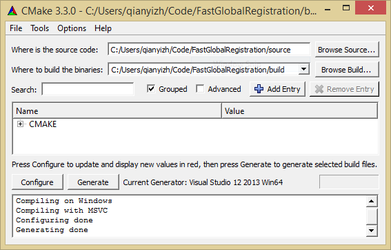

# Fast Global Registration

## Introduction

This is an open source C++ implementation based on the technique presented in
the following paper ([download](docs/fast-global-registration.pdf)):

Fast Global Registration  
Qian-Yi Zhou, Jaesik Park, and Vladlen Koltun  
ECCV 2016  

The source code and dataset are published under the MIT license. See [LICENSE](LICENSE) for details. In general, you can use them for any purpose with proper attribution. If you do something interesting with the code, we'll be happy to know about it. Feel free to contact us.

We include two external libraries ([Eigen](https://eigen.tuxfamily.org/) and [flann](http://www.cs.ubc.ca/research/flann/)) in the codebase for easy compilation. Both of them are under a BSD-style license. See [source/External/README.txt](source/External/README.txt) for details.

## Compilation

FastGlobalRegistration is compiled using [CMake](https://cmake.org/). All dependencies are included in the codebase.

### Ubuntu

The compilation has been tested on Ubuntu 16.04 (gcc 5.4) and Ubuntu 15.10 (gcc 4.9).

```
> mkdir build
> cd build
> cmake ../source/
> make
```

### OS X

The compilation has been tested with El Capitan (Clang or Xcode) and Sierra (Clang or Xcode). Follow the instructions in the Ubuntu section to compile from console with Clang. If you want to use Xcode.
```
> mkdir build-xcode
> cd build-xcode
> cmake -G Xcode ../source/
> open FastGlobalRegistration.xcodeproj/
```

### Windows

The compilation has been tested with Windows 8 and 10, Visual Studio 2013 and 2015. You can use the CMake GUI as follows. Click **Configure** and choose the correct Visual Studio version, then click **Generate**. Open the solution file with Visual Studio, change the build type to **Release**, then **rebuild** the **ALL_BUILD** target.



## Running FastGlobalRegistration

The FastGlobalRegistration program takes three parameters: a file storing the features of the target point cloud, a file storing the features of the source point cloud, an output file that contains a transformation in [.log trajectory file format](http://redwood-data.org/indoor/fileformat.html).

We have provided a synthetic dataset in the [dataset](dataset) folder. For example, you can run the program from console.
```
> FastGlobalRegistration/FastGlobalRegistration \
../dataset/pairwise_noise_xyz_level_02_01_rot_05/features_0000.bin \
../dataset/pairwise_noise_xyz_level_02_01_rot_05/features_0001.bin \
output.txt
```

### Evaluation
To evaluate the output transformation, use [evaluate.py](source/Toolbox/evaluate.py) from the Toolbox folder.
```
> python evaluate.py \
../../dataset/pairwise_noise_xyz_level_01_01_rot_05/output.txt \
../../dataset/pairwise_noise_xyz_level_01_01_rot_05/gt.log \
../../dataset/pairwise_noise_xyz_level_01_01_rot_05/gt.info
```
The evaluation method follows the protocol defined in [this page](http://redwood-data.org/indoor/registration.html).

### Creating input

The input files are binary files storing the features of the point clouds. Each file starts with a 4-byte integer indicating the number of points, denoted as N. Then N points are stored sequentially with each point represented as (3+K) floats. The (3+K) floats are the x,y,z coordinates and a K-vector representing the feature vector associated with the point. K is the feature dimension. By default, we use FPFH feature. K = 33.

If you are familiar with [PCL](www.pointclouds.org), the following code creates such a binary feature file.
```cpp
// Assume a point cloud with normal is given as
// pcl::PointCloud<pcl::PointNormal>::Ptr object

pcl::FPFHEstimationOMP<pcl::PointNormal, pcl::PointNormal, pcl::FPFHSignature33> fest;
pcl::PointCloud<pcl::FPFHSignature33>::Ptr object_features(new pcl::PointCloud<pcl::FPFHSignature33>());
fest.setRadiusSearch(feature_radius_);  
fest.setInputCloud(object);
fest.setInputNormals(object);
fest.compute(*object_features);

FILE* fid = fopen("features.bin", "wb");
int nV = object->size();
fwrite(&nV, sizeof(int), 1, fid);
for (int v = 0; v < nV; v++) {
    const pcl::PointNormal &pt = object->points[v];
    float xyz[3] = {pt.x, pt.y, pt.z};
    fwrite(xyz, sizeof(float), 3, fid);
    const pcl::FPFHSignature33 &feature = object_features->points[v];
    fwrite(feature.histogram, sizeof(float), 33, fid);
}
fclose(fid);
```

### Tuning parameters

The relevant parameters are defined in [app.h](source/FastGlobalRegistration/app.h) as macros.
```cpp
#define DIM_FPFH			33		// FPFH feature dimension
#define DIV_FACTOR			1.4		// Division factor used for graduated non-convexity
#define MAX_CORR_DIST		0.025	// Maximum correspondence distance.
#define ITERATION_NUMBER	64		// Maximum number of iteration
#define TUPLE_SCALE			0.95	// Similarity measure used for tuples of feature points.
#define TUPLE_MAX_CNT		300		// Maximum tuple numbers.
```

To use a different feature. Change **DIM_FPFH** to the dimension of the feature and write corresponding feature in the binary input file.

**MAX_CORR_DIST** determines when the optimization will stop. In general, **MAX_CORR_DIST * diameter_of_model** should be set close to the threshold used to determine if a point pair is a match in global space. If you don't know how to set it, start with the default value **0.025**.

**TUPLE_MAX_CNT** trades off between speed and accuracy. Increasing it will make the optimization slower but the result can be more accurate.
